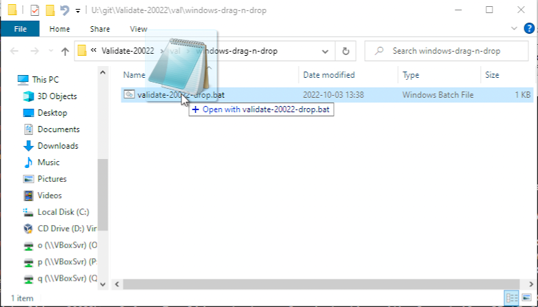
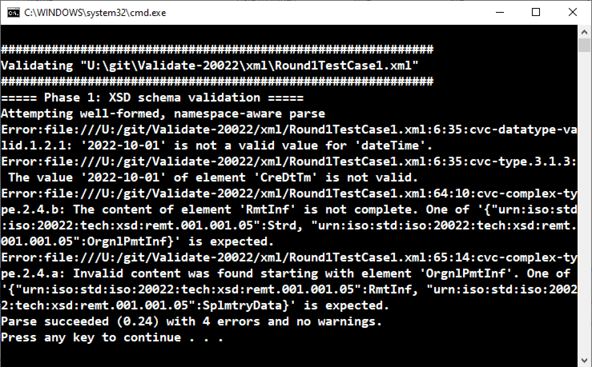

# Validate-20022

An environment with which to validate XML documents against the ISO-20022 XSD schema:

- `remt.001.001.05.xsd`

... and a Schematron file reflecting the BPC data integrity rules for `remt.001.001.05` data:

- `BPC-Remittance-Rules.sch`

## Release packages

Download and unzip the latest development release named:

- `Validate-20022-tools-CCMMYYDD-HHMMSSz.zip`

This creates:

- `archive-only-not-in-final-distribution/` directory with information about building this environment
- `Validate-20022-CCMMYYDD-HHMMSSz.zip` distribution package for end-users

The distribution package is what is made available to end users who want to run the environment. When this ZIP file is unzipped, one finds:

- `readme-validation-artefacts.html` with a description of the packages and all invocation information found below
- `release.txt` and `release-CCMMYYDD-HHMMSSz.txt` used to distinguish this package from other packages
- `bpc/` directory of Schematron resources and rules spreadsheets
- `val/` directory of validation invocations and open-source software
- `xml/` directory of sample XML files
- `iso/` directory of W3C Schema files

## Complete documentation

The `readme-validation-artefacts.html` in the distribution has the complete documentation for this environment.

#### Invocation summary

To validate a test document of one’s own that is found in your local computer file system there is a Java-based invocation for each of the Windows and Shell environments:
- Windows drag-n-drop:
  - fully extract the nested ZIP files into your file system because drag-n-drop does not work from inside ZIP extractor virtual directories
  - open the unzipped val/windows-drag-n-drop/ directory in Windows Explorer to reveal the available invocations (pro tip: pre-click once on the batch file you intend to use so that it is highlighted when the time comes to drop a file on it; this will make it easier to locate in the list for dropping)
  - drag your XML file from Windows Explorer where it is being edited, and drop it onto the corresponding invocation batch file performing the desired validation
  - a dynamic command DOS box window will open up revealing the results until a key is pressed to make the window disappear

  

  
- Windows DOS prompt:
  - `validate-20022.bat 20022-xml-file`
  - for example from the test.bat demonstration:
    - `call validate-20022.bat iso-20022-test-good.xml`
- Shell:
  - `sh validate-20022.sh 20022-xml-file`
  - for example from the test.sh demonstration:
    - `sh validate-20022.sh iso-20022-test-good.xml`

When there is a schema error of any kind, the script creates a file named by adding the “.error.txt” suffix to the input file name and records the error information in that file.

When there is a Schematron data integrity error, the script also creates a file named by adding the “.svrl.xml” suffix to the input file name and records the Schematron SVRL record information in that file.

Please consult the HTML readme file for a complete description of how to use the distribution package.
